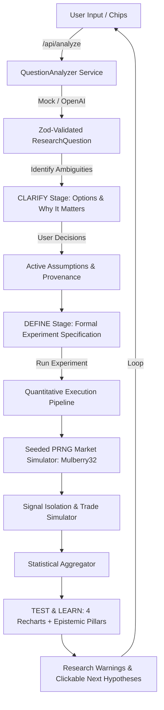

# AI-Native Trading Research Assistant

> Turn ambiguous natural-language market questions into structured, testable quantitative experiments with rigorous separation between data and AI interpretation.

---

## Overview

The **AI-Native Trading Research Assistant** is a purpose-built quantitative research environment designed to bridge the gap between vague conversational market inquiries and disciplined statistical evaluation.

Traditional chatbots often fabricate trading rules or blindly generate code with unstated biases. This system enforces an institutional 5-stage research lifecycle:

$$\textbf{ASK} \longrightarrow \textbf{CLARIFY} \longrightarrow \textbf{DEFINE} \longrightarrow \textbf{TEST} \longrightarrow \textbf{LEARN}$$

1. **ASK**: Accept an unconstrained natural-language research question.
2. **CLARIFY**: Detect ambiguous phrases (e.g., *"sharp fall"*), highlight missing variables, and present structured alternatives with domain justifications.
3. **DEFINE**: Generate a formal, verifiable experiment object model comparing the user's plain question against the AI's mathematical interpretation.
4. **TEST**: Execute a deterministic backtest using a seeded synthetic market generator (1,250 trading bars) to calculate empirical metrics and equity trajectories.
5. **LEARN**: Rigorously separate **What the Data Shows** (raw facts) from **What This Might Mean** (hypothesis reflection) and **What We Can Reasonably Conclude** (prudent risk disclaimers).

---

## Problem Solved

Traders and researchers frequently ask broad market questions:
- *"Does buying NIFTY after a sharp fall work?"*
- *"Does buying NIFTY after a 1% fall have an edge?"*
- *"Does buying NIFTY after a 1% fall work better during high-volatility periods?"*

Naïve AI systems typically respond with confident answers without clarifying:
- What constitutes a "sharp fall"? (1%, 2%, 3%, or standard deviation outlier?)
- What is the holding horizon? (Next-day close, 3-day swing, or trailing stop?)
- What historical window and regime filters apply?
- What transaction frictions and slippage assumptions are made?

By surfacing latent assumptions and forcing user confirmation before running calculations, this prototype demonstrates responsible, institutional-grade AI behavior.

---

## System Architecture



### 1. Frontend Workspace (`app/` & `components/`)
- **Next.js 14 App Router** with React 18, TypeScript, and Tailwind CSS.
- Dark-first fintech aesthetic inspired by modern institutional research terminals (Bloomberg meets modern AI workspace).
- Persistent right-hand **Experiment Context Panel** tracking provenance:
  - `User Said`: Explicitly articulated by the user.
  - `AI Inferred`: Contextually deduced by the system.
  - `Assumed`: Default prototype convention requiring review.
  - `Missing`: Necessary parameter absent from the prompt.
- **Recent Research Drawer** backed by `localStorage` for rapid session re-execution.

### 2. AI Parsing Layer (`lib/ai/`)
- `QuestionAnalyzer` interface establishing an extensible service boundary.
- `MockQuestionAnalyzer`: A deterministic NLP engine that extracts symbols, percentages, holding periods, volatility regimes, and detects edge cases (vague queries, conflicting rules, unsupported instruments).
- `OpenAIQuestionAnalyzer`: Optional production-ready integration with OpenAI GPT models via server-side JSON schema parsing with automatic fallback.

### 3. Backtest & Math Engine (`lib/backtest/`)
- `market-data.ts`: Seeded PRNG (`Mulberry32`) generating 5 years (~1,250 bars) of synthetic NIFTY 50 OHLCV data with Box-Muller Gaussian returns and 20-day rolling volatility clustering.
- `signals.ts`: Pure functional condition matching supporting percentage thresholds and volatility percentile filters ($\ge 75\text{th}$ percentile for high-volatility).
- `backtest.ts`: Event-study and daily equity curve simulation computing trade returns, gross/net profits, and benchmark comparisons.
- `statistics.ts`: Mathematical calculation of signals count, win rate, average return, unconditional baseline drift, estimated edge, max drawdown, and empirical distribution histogram bins.

---

## Technology Stack

- **Framework**: Next.js 14 (App Router)
- **Language**: TypeScript 5 (Strict Mode)
- **Styling**: Tailwind CSS, PostCSS, Autoprefixer
- **Charts**: Recharts (Line, Bar, Distribution Histogram, Price Series)
- **Icons**: Lucide React
- **Validation**: Zod
- **Utility**: `clsx`, `tailwind-merge`

---

## How to Run Locally

### Prerequisites
- Node.js `v18.x` or higher (tested on `v24.18.0`)
- npm `v9.x` or higher (tested on `v11.12.0`)

### Installation & Startup

```bash
# 1. Clone or open the repository
cd Trading-research-assisant

# 2. Install dependencies
npm install

# 3. Start development server
npm run dev

# 4. Open browser
# Navigate to http://localhost:3000
```

### Production Build & Typecheck

```bash
# Verify TypeScript types
npx tsc --noEmit

# Build production bundle
npm run build

# Start production server
npm run start
```

---

## AI Usage

This project was built pair-programming with **Antigravity** (Google DeepMind):
- **AI-Assisted**: Architectural scaffolding, Next.js configuration, mathematical backtest algorithms, deterministic PRNG data generator, and Recharts component setups.
- **Human/Agent Design Alignment**: Strict epistemic separation between data facts and interpretive hypotheses, institutional research warnings, edge case guardrails, and Bloomberg-inspired dark terminal visual design.

---

## Key Design Decisions

1. **Surfacing Ambiguity Over Guessing**: Instead of guessing what "sharp fall" means, the assistant displays a dedicated clarification step explaining *why* the choice matters.
2. **Deterministic Simulation**: Uses a seeded pseudo-random number generator so identical experiments produce identical, reproducible numbers across machines.
3. **Strict Epistemic Separation**:
   - `01 // WHAT THE DATA SHOWS`: Pure facts and descriptive statistics.
   - `02 // WHAT THIS MIGHT MEAN`: Hypothesis interpretation.
   - `03 // WHAT WE CAN REASONABLY CONCLUDE`: Rigorous risk and significance caveats.
4. **Transparent Provenance**: Badges make it impossible to mistake AI default assumptions for user instructions.
5. **No Monolithic Components**: Clean separation between UI presentation, analytical schemas, and mathematical calculations.

---

## Limitations

- **Simulated Data**: Uses synthetic geometric Brownian motion with volatility jumps; does not connect to live or historical NSE exchange tick data.
- **Microstructure Frictions**: Prototype assumes idealized fills at closing prices without modeling real-time order-book bid-ask spreads or market impact.
- **Statistical Significance**: Computes sample edge and win rates; does not calculate Student's t-test p-values, bootstrap confidence intervals, or FDR adjustments.

---

## Future Roadmap

1. Connect to real market data providers (Zerodha Kite Connect, Interactive Brokers, Yahoo Finance).
2. Connect to vector databases (pgvector) for long-term historical research memory.
3. Support multi-asset comparative research (e.g., NIFTY vs BANKNIFTY vs sector indices).
4. Add Monte Carlo permutation tests to establish formal p-values against data snooping.
5. Incorporate intraday 5-minute and 15-minute timeframe execution.
